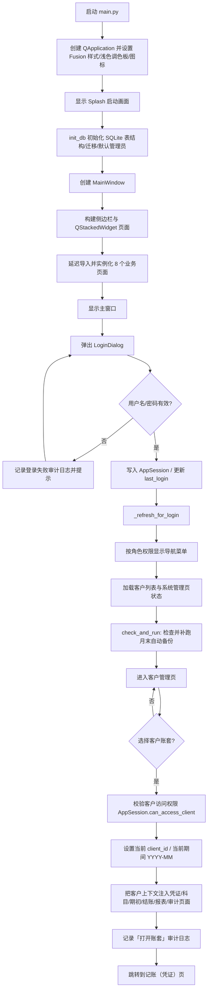
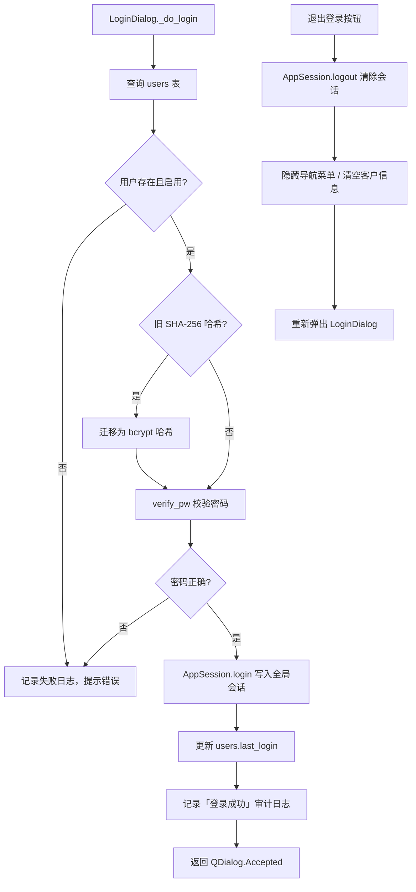
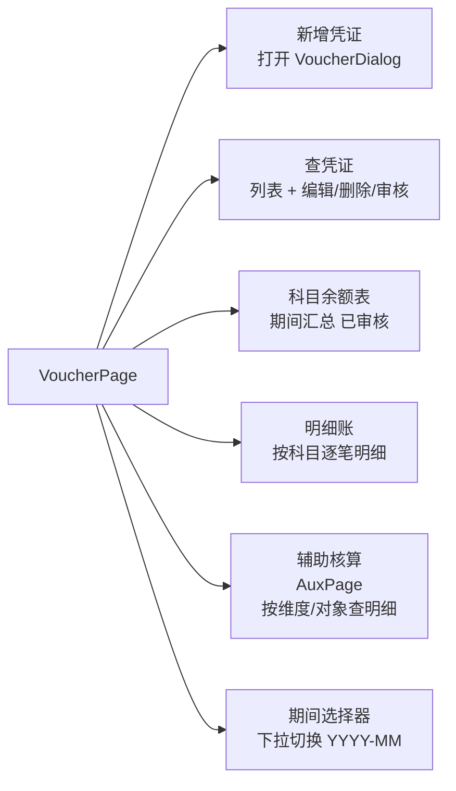
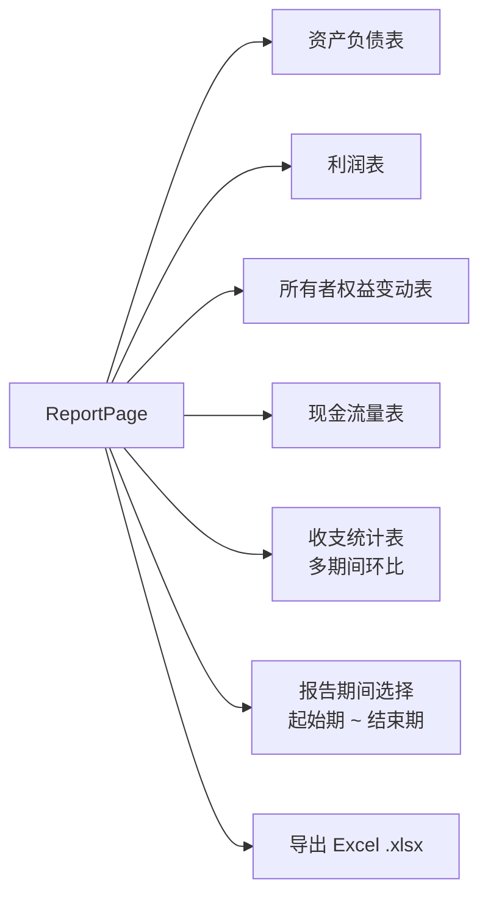
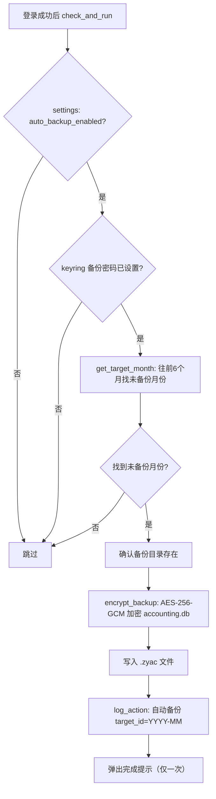
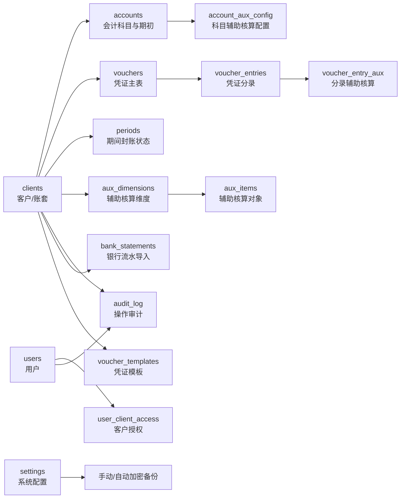

# 智一盈小账程序流程图

本文档基于当前代码结构整理，重点覆盖程序启动、登录鉴权、账套选择、凭证处理、期末结账、报表与审计日志的数据流。

## 1. 程序主流程



## 2. 登录与退出



## 3. 财务业务闭环

```mermaid
flowchart TD
    A[客户管理] --> B{新建/导入账套}
    B --> C[创建客户信息（名称/税号/客户类型/会计准则）]
    C --> D[seed_client_accounts: 初始化标准会计科目]
    D -- 企业会计准则 --> D1[STANDARD_ACCOUNTS ~300条]
    D -- 小企业会计制度 --> D2[STANDARD_ACCOUNTS_SMALL ~150条]
    D1 & D2 --> E[科目管理]
    E --> F[维护科目树/辅助核算绑定 account_aux_config]
    F --> G[科目期初]
    G --> H{是否为建账期或每年 1 月?}
    H -- 否 --> I[禁止录入期初]
    H -- 是 --> J[录入/修改末级科目期初余额]

    J --> K[记账（凭证）页]
    F --> K
    K --> L[新增凭证 / 套用凭证模板]
    L --> M{期间是否已封账?}
    M -- 是 --> N[禁止新增/修改/删除/审核]
    M -- 否 --> O[校验分录]

    O --> P{校验通过?}
    P -- 否 --> Q[提示修正: 科目/辅助核算/借贷平衡]
    Q --> L
    P -- 是 --> R[写入 vouchers / voucher_entries / voucher_entry_aux]
    R --> S[记录审计日志]
    S --> T[凭证状态: 待审核]

    T --> U{审核操作 (admin/superadmin)}
    U -- 拒绝 --> V[状态改为已拒绝并记日志]
    U -- 通过 --> W{借贷是否平衡?}
    W -- 否 --> Q
    W -- 是 --> X[状态改为已审核并记日志]

    X --> Y[财务报表（仅汇总已审核凭证）]
    X --> Z[科目余额表 / 明细账 / 辅助核算]

    X --> AA[期末结账]
    AA --> AB{有待审核凭证?}
    AB -- 是 --> AC[阻止结转/封账]
    AB -- 否 --> AD[生成收入/费用结转凭证（状态直接为已审核）]
    AD --> AE{封账检测通过?}
    AE -- 否 --> AC
    AE -- 是 --> AF[写入 periods.is_closed=1]
    AF --> AG[期间封账]

    AG --> AH{需要修改?}
    AH -- 是 --> AI[反结账: periods.is_closed=0]
    AI --> K
    AH -- 否 --> AJ[审计日志查询/导出]
```

## 4. 凭证页标签结构



## 5. 财务报表标签结构



## 6. 自动备份流程



## 7. 加密备份文件格式（.zyac）

| 偏移 | 长度 | 内容 |
|------|------|------|
| 0 | 4B | 魔数 `ZYAC` |
| 4 | 16B | PBKDF2 salt（随机） |
| 20 | 12B | AES-GCM nonce（随机） |
| 32 | N+16B | AES-256-GCM 密文 + GCM Tag |

密钥派生：PBKDF2-HMAC-SHA256，600,000 次迭代（OWASP 2023 推荐）

## 8. 核心数据表关系



## 9. 角色权限矩阵

| 权限 | superadmin | admin | accountant | readonly |
|------|:---:|:---:|:---:|:---:|
| client.view | ✓ | ✓ | ✓ | ✓ |
| client.manage | ✓ | ✓ | | |
| account.view | ✓ | ✓ | ✓ | ✓ |
| account.manage | ✓ | ✓ | | |
| opening.view | ✓ | ✓ | ✓ | ✓ |
| opening.manage | ✓ | ✓ | | |
| voucher.view | ✓ | ✓ | ✓ | ✓ |
| voucher.create | ✓ | ✓ | ✓ | |
| voucher.edit | ✓ | ✓ | ✓ | |
| voucher.delete | ✓ | ✓ | | |
| voucher.approve | ✓ | ✓ | | |
| settle.manage | ✓ | ✓ | | |
| report.view | ✓ | ✓ | ✓ | ✓ |
| report.export | ✓ | ✓ | ✓ | |
| audit.view | ✓ | ✓ | | |
| system.manage | ✓ | | | |

## 10. 代码依据

- `main.py`：`_NAV_ITEMS` 定义主菜单与权限；`MainWindow._build()` 创建 8 个业务页面；`_refresh_for_login()` 登录后刷新导航和触发自动备份；`_open_client()` 把客户上下文注入各业务页面。
- `login_dialog.py`：`LoginDialog._do_login()` 完成用户查询、密码校验（含旧 SHA-256 → bcrypt 迁移）、登录日志和 `AppSession.login()`。
- `session.py`：`ROLE_PERMISSIONS` 和 `AppSession` 负责角色权限与客户访问控制；`can_access_client()` 查询 `user_client_access` 表。
- `db.py`：`init_db()` 创建所有核心表并调用 `_migrate_db()` 幂等迁移；`log_action()` 统一写审计日志（自动取本地时间）；`seed_client_accounts()` 按会计准则为账套初始化标准科目；`VOUCHER_TEMPLATES` 定义 25 个预置凭证模板。
- `backup_utils.py`：`encrypt_backup()` / `decrypt_backup()` 实现 AES-256-GCM 加密备份。
- `auto_backup.py`：`check_and_run()` 登录时检测并补跑月末自动备份，最多回溯 6 个月。
- `kr_utils.py`：跨平台 keyring 封装，备份密码存储于系统凭据管理器。
- `pages/voucher.py`：5 标签页（新增/查凭证/科目余额表/明细账/辅助核算）；`VoucherPage` 处理凭证增删改审核、期间封账限制。
- `pages/settle.py`：2 步骤结账流程；`SettlePage` 处理期末结转、封账检测、期间封账和反结账；结转完成后发出 `carryforward_done` 信号跳转凭证页。
- `pages/report.py`：5 标签页报表（资产负债表/利润表/所有者权益变动表/现金流量表/收支统计表）；报表查询只汇总 `status='已审核'` 的凭证；支持起止期间选择和 Excel 导出。
- `pages/audit.py`：按客户、日期、操作类型查询/导出审计日志。
- `pages/system.py`：用户管理、客户授权、手动备份/恢复、自动备份配置；superadmin 专属。
