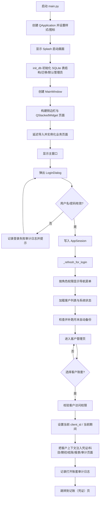
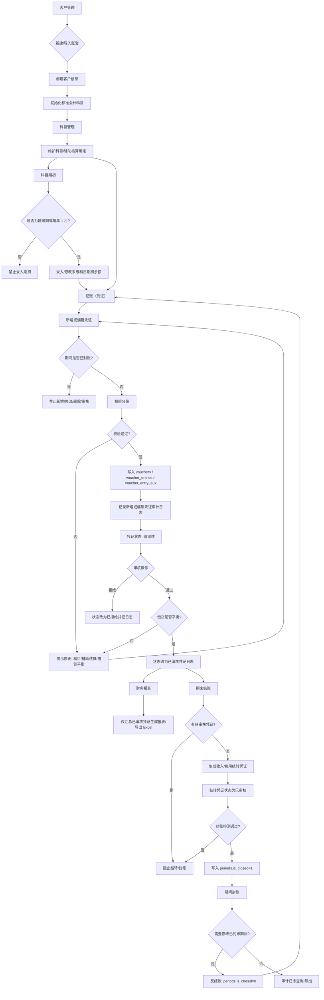
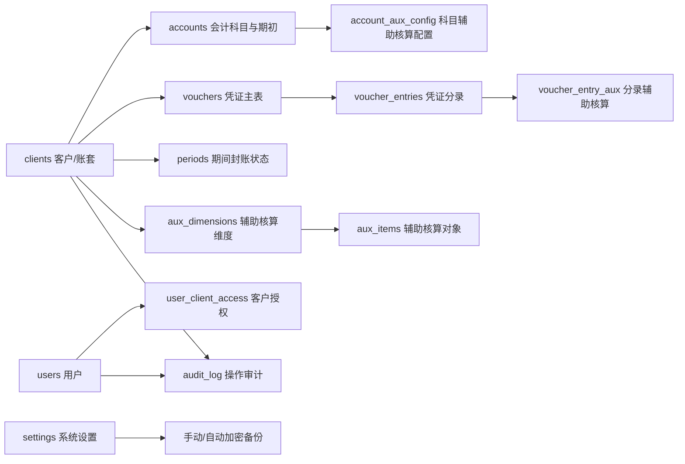

# 智一盈小账程序流程图

本文档基于当前代码结构整理，重点覆盖程序启动、登录鉴权、账套选择、凭证处理、期末结账、报表与审计日志的数据流。

## 1. 程序主流程

## 2. 财务业务闭环

## 3. 核心数据表关系

## 4. 代码依据

- `main.py`：`_NAV_ITEMS` 定义主菜单与权限；`MainWindow._build()` 创建页面栈；`_refresh_for_login()` 登录后刷新导航和自动备份；`_open_client()` 把客户上下文注入各业务页面。
- `login_dialog.py`：`LoginDialog._do_login()` 完成用户查询、密码校验、旧哈希迁移、登录日志和 `AppSession.login()`。
- `session.py`：`ROLE_PERMISSIONS` 和 `AppSession` 负责角色权限与客户访问控制。
- `db.py`：`init_db()` 创建核心表；`log_action()` 统一写审计日志；`seed_client_accounts()` 为账套初始化标准科目。
- `dialogs/voucher_dialogs.py`：`VoucherDialog._save()` 校验凭证分录、辅助核算、借贷平衡，并写入凭证表/分录表。
- `pages/voucher.py`：`VoucherPage` 处理凭证新增、编辑、删除、审核、期间封账限制与凭证查询。
- `pages/settle.py`：`SettlePage` 处理期末结转、封账检测、期间封账和反结账。
- `pages/report.py`：报表查询只汇总 `status='已审核'` 的凭证数据。
- `pages/audit.py`：审计日志页面按客户、日期和操作类型查询/导出关键操作。

